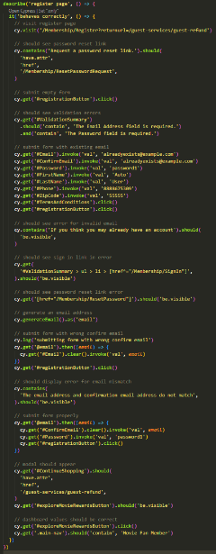

- [1. The Dilemma](#1-the-dilemma)
- [2. Custom Commands](#2-custom-commands)
- [3. Quick & Dirty Intent: Comments, Logging](#3-quick--dirty-intent-comments-logging)
- [4. A Better Way, Part 1: Abstracting Intent in the Code](#4-a-better-way-part-1-abstracting-intent-in-the-code)
- [5. A Better Way, Part 2: Grouping Custom Commands in the Log](#5-a-better-way-part-2-grouping-custom-commands-in-the-log)
- [6. A Better Way, Part 3: Grouping Steps in the Log](#6-a-better-way-part-3-grouping-steps-in-the-log)

---

## 1. The Dilemma

Do you write lengthy end-to-end tests? I do. I *want* my tests to be short and quick, but I have my reasons for writing lengthy tests sometimes, and maybe you do too.

The Cypress Test Runner's log is pretty great. You can see all the actions of your test as they happen, like this:


But when you've been away from a test for a while (especially a lengthy test) it can take some time to remember what your original intent was:


For example, why are we filling in the `#Email` field a second time? And I'm familiar enough with Cypress to guess that `get @email` is fetching an email address from an alias, but which one and why?

Let's see if the code offers any clues:


OK, so it looks to me like we're generating a unique email address and typing it into the field. But the reasons I know this are...
1. I already know about `cy.wrap()`
2. I already know how and why aliases are used
3. I already know what `.invoke('val', email)` implies (it's an alternative to `.type()`)

 So anyone new to Cypress might be a bit lost here. That's why it's important for the test author to communicate *intent*. A little bit of intent goes a long way toward achieving comprehension.
 
I see one opportunity already, which leads to my next sub-topic:

## 2. Custom Commands

Generating an email address is definitely something I'll be doing more than once across my entire test suite. This makes it an excellent candidate for a [custom command](https://docs.cypress.io/api/cypress-api/custom-commands), which has the additional benefit of helping with intent.

Let's move some of that code into a custom command and see what we have now:


OK that's a bit better. Not only do I have a reusable command, I'm also better able to understand the code. But we're not there yet! I still don't know why my test is filling in the email address for a second time.

So let's try the obvious:

## 3. Quick & Dirty Intent: Comments, Logging

Let's see what happens when we have some handy comments and log statements.


Hey look, I even got fancy with my custom command log!


And here's what that gets us:


Not bad. But I think we can do better. Even as an experienced Cypress developer I have to stare at that log a while before I know what I'm looking at. And even though this is a short test, the code is pretty lengthy!



Even with excellent comments you end up with a lot of scrolling, and putting `cy.log()` everywhere only adds to the mess.

## 4. A Better Way, Part 1: Abstracting Intent in the Code

A pattern I've grown fond of is wrapping every logical group of code (aka "step") into its own function. Nothing fancy, just a locally-scoped classic function, defined further down in the file.

With this approach, our full test now looks like this:


I consider that a huge improvement! It is a bit of a tradeoff: it becomes a little more tedious to step through a file this way, but the ability to jump into an old file and immediately understand the intent makes this tradeoff more than worth it.

But a problem remains: our Test Runner log still looks like a CVS receipt. (And remember, this is a *short* test!)


Actual CVS receipt for comparison:


But what can we actually do about this? We don't want to start throwing `{ log: false }` everywhere, do we? Everything that's on that log, we want to see (for the most part).

OK this is where things start to get a little non-standard.

## 5. A Better Way, Part 2: Grouping Custom Commands in the Log

If you observe some Cypress features like `cy.session()` you'll notice that they create a neat little collapsible entry into the Cypress log, like so:


Hey that's what I want! When you dig through the Cypress source code for `cy.session()` you'll find them using an option called `groupStart`. This is what we need.

It turns out, `groupStart` and `groupEnd` can be applied to *any* custom command. Let's try it. I'll start by applying that to `cy.newUser()`, a custom command I use all the time.

Ungrouped, `cy.newUser()` looks like this in the log:


Yikes! And that's just one command!

So let's try grouping. Here's `cy.newUser()` nicely grouped:


Wow, what a difference! 😲 We went from 28 lines in the log down to 1 line. And we can expand it if we want to see the guts.

So how do you do this with your own code? Follow the pattern here for `cy.newUser()`, but with [your own command](https://docs.cypress.io/api/cypress-api/custom-commands):

```js
Cypress.Commands.add('newUser', () => {
  const message = '**newUser** ~ registering a new user'

  const log = Cypress.log({
    name: 'command',
    message: message,
    groupStart: true,
  })

  cy.generateEmail(false).then((email) => {
    registerEmail(email)

    cy.endGroup()
    cy.wrap(email, { log: false })
  })
})
```

Notice it references a special custom command, `cy.endGroup()`. This is how you mark the end of your collapsible section.

> Nuance alert: Cypress custom commands' yield is set to the yield of the last `cy` command run. Since we want to run `cy.endGroup()` at the end of our command, if we need the command to provide a yield we need to follow up `cy.endGroup()` with an unlogged `cy.wrap()` to set the yield by force.

You'll need to define `cy.endGroup()` like so:

```js
Cypress.Commands.add('endGroup', () => {
  collapseLastGroup()
  Cypress.log({ groupEnd: true, emitOnly: true })
})

function collapseLastGroup() {
  const openExpanders = window.top.document.getElementsByClassName(
    'command-expander-is-open',
  )
  const numExpanders = openExpanders.length
  const el = openExpanders[numExpanders - 1]

  if (el) el.parentElement.click()
}
```

The `collapseLastGroup()` function is a little hack to autoclose the groups after they've completed. It makes a big difference.

## 6. A Better Way, Part 3: Grouping Steps in the Log

Grouping *steps* in the code makes a huge readability difference in the *editor*. Grouping *commands* makes a huge readability difference in the *log*. But wouldn't it be nice to do *both* of these things in the log? Yes, it would.

And you can! With some kludging. First, let's take another look at our abstracted steps:


Now let's look at the definition of that first function, `visitRegisterPage()`:


That first line is the kludge. There may be better ways to do this, but this is the only one I know of myself. It's referencing a value on the Cypress object, containing a string representation of a function. (Never mind that `cy.checkpoint()` for now; maybe I'll talk about that in a future blog post.)

Here is the definition. This goes in your `e2e.js` file (the JavaScript file which is run before each test when doing e2e testing).

```js
// Use to print the current function for logging test steps
// Usage: eval(Cypress.logStep)
Cypress.logStep =
  'const s = new Error().stack;' +
  "const stackLine = new Error().stack.split('\\n')[2].trim();" +
  'const fncName = stackLine.match(/(?<=at )(.*)(?= \\()/gm)[0];' +
  'cy.logStep(fncName);'
```
...and further down...
```js
Cypress.Commands.add('logStep', (message) => {
  collapseLastGroup()
  logPreviousStepTiming()
  logTimestampToNodeConsole()
  Cypress.stepTime = performance.now()
  Cypress.stepName = message
  Cypress.log({ groupEnd: true, emitOnly: true })
  Cypress.log({
    name: 'step 🦶',
    message: `**${message}**`,
    groupStart: true,
    snapshot: true,
  })

  function logPreviousStepTiming() {
    if (Cypress.stepTime) {
      const endTime = performance.now()
      const diff = ((endTime - Cypress.stepTime) / 1000).toFixed(1)
      cy.log(`step ${Cypress.stepName} took ${diff} seconds`)
    }
  }

  function logTimestampToNodeConsole() {
    const stamp = dayjs().format('h:mm:ss a')
    cy.task('nodeLog', { message: `timestamp ${stamp}` })
  }
})

function collapseLastGroup() {
  const openExpanders = window.top.document.getElementsByClassName(
    'command-expander-is-open',
  )
  const numExpanders = openExpanders.length
  const el = openExpanders[numExpanders - 1]

  if (el) el.parentElement.click()
}
```

What `Cypress.logStep` is doing is extracting the currently-executing function name from the the `Error().stack` value. We save it as a string and execute it using an `eval()` within our test in order to maintain the proper context.*

> **If we called the function in a more traditional way then _that_ function would become the context, and we'd get `logStep()` back as our return value.*

So then we follow this pattern:
- Wrap each step in an appropriately-named function
- Start each step function with `eval(Cypress.logStep)`

And what does that get us?


Aaaahhh, I can feel my blood pressure lowering already 😌
